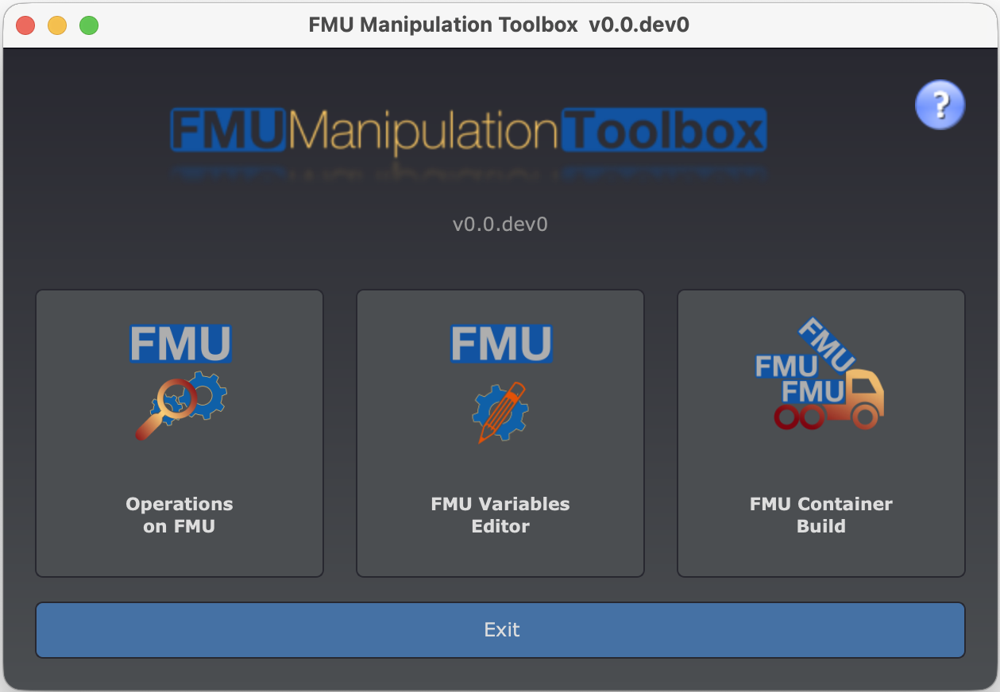

# 👀 Overview

FMU Manipulation Toolbox is a python package which helps to analyze, modify or combine
[Functional Mock-up Units (FMUs)](http://fmi-standard.org/) without recompilation. It is highly customizable and comes with
a Python API.

FMU Manipulation Toolbox can be used in different ways:
- Using a Graphical User Interface: suitable for end users
- Using a Command Line Interface: useful for scripting and automation
- Using a Python API: the most efficient option for automation (CI/CD, transformation scripts, ...))

Major features:
- Analyze FMU content: list ports and their attributes, check compliance of `ModelDescription.xml` with XSD, etc.
- Alter FMU by modifying its `modelDescription.xml` file. NOTE: manipulating this file can be a risky.
  When possible, it is preferable to communicate with the FMU developer and adapt the FMU generation process.
- Add binary interfaces. Typical use case is porting a 32-bit FMUs to 64-bit systems (or vice et versa). 
- Combine FMUs into [FMU Containers](docs/user-guide/fmucontainer/container.md) and allow your favourite FMI tool to orchestrate complex assembly of FMUs.

FMI versions 2.0 and 3.0 are supported.

# ⚙️ Installation

Two options available to install FMU Manipulation Toolbox:

- (*Easiest option*) Install with from PyPI: `pip install fmu-manipulation-toolbox`. This will install the latest
  version of FMU Manipulation Toolbox and all its dependencies. See [PyPI page](https://pypi.org/project/fmu-manipulation-toolbox/).
- Compile and install from [GitHub repository](https://github.com/grouperenault/fmu_manipulation_toolbox). You will need 
  - Python required packages. See [`requirements.txt`](requirements.txt).
  - C compiler (C99 or later)
  - CMake (>= 3.20)


### Supported platforms

FMU Manipulation Toolbox is packaged for:
- Windows 10/11 (primary platform)
- Linux (Ubuntu 22.04)
- Darwin


# 🖥️ Graphical User Interface

FMU Manipulation Toolbox is released with a GUI. You can launch it with the following command `fmutool-gui`



Button colors descriptions:
- red: remove information from the `modelDescription.xml`
- orange: alter `modelDescription.xml`
- green: add component into the FMU or check it
- violet: extract and save
- blue: filter actions scope or exit

**Original FMU is never modified**. Use `Save` button to get modified copy of the original FMU.


# 🔧 Command Line Interface

FMU Manipulation Toolbox comes with 2 commands:
- `fmutool`: a versatile analysis and manipulation tool for FMU.
- `fmucontainer`: group FMUs inside FMU Containers. (see [container/README.md](container/README.md))
- `fmusplit: to extract FMUs from a FMU Container.


# 🚀 API

You can write your own FMU Manipulation scripts. Once you downloaded fmutool module, 
adding the `import` statement lets you access the API :

```python
from fmu_manipulation_toolbox.operations import ...
```


## remove toplevel bus (if any)

Given a FMU with the following I/O structure
```
├── Parameters
│   ├── Foo
│   │   ├── param_A
│   ├── Bar
├── Generator
│   ├── Input_A
│   ├── Output_B
```

The following transformation will lead into:
```
├── Foo
│   ├── param_A
├── Bar
├── Input_A
├── Output_B
```

**Note:** removing toplevel bus can lead to names collisions !

The following code will do this transformation: 
```python
from fmu_manipulation_toolbox.operations import FMU, OperationStripTopLevel

fmu = FMU(r"bouncing_ball.fmu")
operation = OperationStripTopLevel()
fmu.apply_operation(operation)
fmu.repack(r"bouncing_ball-modified.fmu")
```

### Extract names and write a CSV

The following code will dump all FMU's Scalars names into a CSV:

```python
from fmu_manipulation_toolbox.operations import FMU, OperationSaveNamesToCSV

fmu = FMU(r"bouncing_ball.fmu")
operation = OperationSaveNamesToCSV(r"bouncing_ball.csv")
fmu.apply_operation(operation)
```

The produced CSV contains 2 columns in order to be reused in the next transformation.
The 2 columns are identical.

```csv
name;newName;valueReference;causality;variability
h;h;0;local;continuous
der(h);der(h);1;local;continuous
v;v;2;local;continuous
der(v);der(v);3;local;continuous
g;g;4;parameter;fixed
e;e;5;parameter;tunable
```


## Read CSV and rename FMU ports

CSV file should contain 2 columns:
1. the current name
2. the new name

```python
from fmu_manipulation_toolbox.operations import FMU, OperationRenameFromCSV

fmu = FMU(r"bouncing_ball.fmu")
operation = OperationRenameFromCSV(r"bouncing_ball-modified.csv")
fmu.apply_operation(operation)
fmu.repack(r"bouncing_ball-renamed.fmu")
```

More operations exist in [`Operation.py`](fmu_manipulation_toolbox/operations.py)
