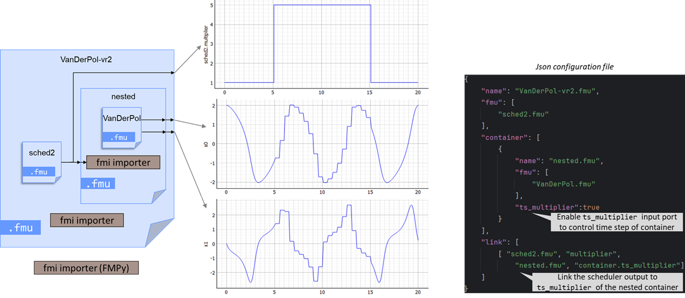

# Container with TS_MULTIPLIER

Sometimes, during the simulation, speed is more important than accuracy.
In such case, having a bigger step size could drastically improve performance.

In this very simple test case, we consider two functional units represented as FMUs.
1. The first FMU, **VanDerPol**, generates two output signals and operates with a variable time step.
2. The second FMU, **sched2**, produces an integer output defined as follows:
    - value 1 for 0 ≤ _t_ < 5,
    - value 5 for 5 ≤ _t_ < 15,
    - value 1 for 15 ≤ _t_ ≤20.

The objective of this study is to use the output of **sched2** to dynamically scale the sampling step of 
the **VanDerPol** FMU, whose default value is 0.1.

For illustration purposes, you can find the JSON file used to construct this co-simulation setup, along with the 
corresponding output figure.
