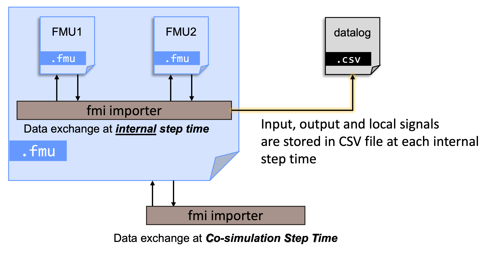

# Container with datalog

To facilitate debugging of FMUs assemblies, the datalog feature is extremely helpful.

By adding the `-datalog` option to the `fmucontainer` command a CSV file is automatically generated. 
The file name is derived from the FMU container’s name and contains the values of all signals exchanged during the 
simulation, recorded at each container time step.
