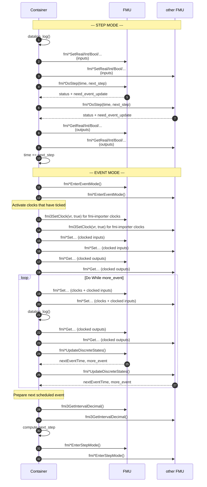

# FMI API Call Sequence during `container_do_step()`

> **Audience**: Developers working on the FMU Container C runtime.

This page documents the sequence of [FMI API](https://www.fmi-standard.org) calls that the
container performs on each embedded FMU during a single call to `container_do_step()`.

The container alternates between **STEP MODE** (continuous-time advancement via `fmi*DoStep`)
and **EVENT MODE** (discrete state updates and clock handling). The diagram below illustrates
the sequence for the **sequential** execution mode; the parallel modes (mono-thread and
multi-thread) follow the same logical order but interleave the `Set` / `DoStep` / `Get` phases
across all FMUs.

## Notes

- `fmu_set_inputs` / `fmu_get_outputs` in the C runtime expand into a series of typed FMI calls
  (`fmi2SetReal`, `fmi3SetFloat64`, `fmi3SetBoolean`, …) according to the ports declared in
  `fmu_io`.
- In the **multi-thread parallel** mode, `fmi*DoStep` is executed concurrently on each FMU via
  per-FMU worker threads, synchronized through `mutex_container` / `mutex_fmu`.
- The EVENT MODE phase is entered only when at least one FMU has reported
  `need_event_update`, or when clocks are declared in `clocks_list`.
- `fmi3GetIntervalDecimal()` is invoked only for FMUs that own scheduled clocks.
