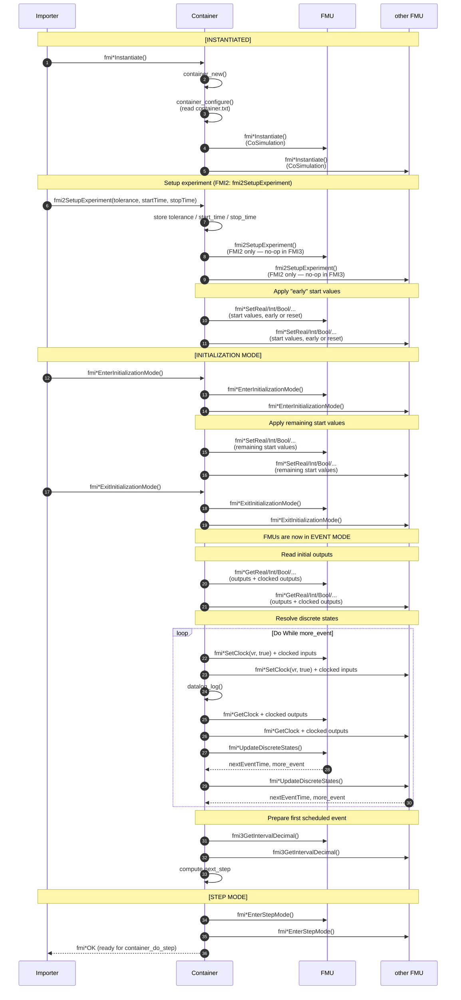

# FMI API Call Sequence during Container Initialization

> **Audience**: Developers working on the FMU Container C runtime.

This page documents the sequence of [FMI API](https://www.fmi-standard.org) calls that the
container performs on each embedded FMU while the container itself is being initialized by the
importer (co-simulation master).

The container goes through the standard FMI lifecycle states
(`INSTANTIATED` → `INITIALIZATION_MODE` → `STEP_MODE`) and propagates every transition to all
embedded FMUs. The diagram below shows the sequence for the **sequential** execution mode; the
parallel modes follow the same logical order.

!!! note "FMI 2.0 vs FMI 3.0"
    In **FMI 2.0** the importer calls `fmi2SetupExperiment()` and then
    `fmi2EnterInitializationMode()` as two separate calls. In **FMI 3.0** there is no
    `SetupExperiment`: the tolerance and time information is passed directly to
    `fmi3EnterInitializationMode()`. Internally the container routes both flavors through the
    same `container_setup_experiment()` / `container_enter_initialization_mode()` helpers, so the
    sequence below applies to both versions.

## Notes

- `fmi*Instantiate` of the **embedded** FMUs happens inside `container_configure()`, which is
  itself called from `fmi2Instantiate` / `fmi3InstantiateCoSimulation`. By the time the importer
  receives the container instance, all embedded FMUs are already instantiated.
- `fmuSetupExperiment()` only emits an FMI call for **FMI 2.0** FMUs
  (`fmi2SetupExperiment`); for **FMI 3.0** FMUs it is a no-op since the equivalent parameters are
  forwarded through `fmi3EnterInitializationMode()`.
- Start values declared in `container.txt` are applied in **two passes**:
  the *early* pass (`container_set_start_values(early=1)`) during setup, and the remaining values
  (`container_set_start_values(early=0)`) once the FMUs are in *Initialization Mode*. Values
  flagged as `reset` are (re)applied in both passes.
- After `fmi*ExitInitializationMode()`, the FMUs are in **EVENT MODE**. The container therefore
  runs one full `container_update_discrete_state()` loop (the same loop used during
  `container_do_step()`) to settle clocks and discrete states before computing the first
  `next_step`.
- `fmi3GetIntervalDecimal()` is invoked only for FMUs that own scheduled clocks.
- Once `fmi*EnterStepMode()` returns, the container is in `STEP_MODE` and ready for the first
  call to `container_do_step()` (see [DoStep FMI Sequence](dostep-fmi-sequence.md)).

