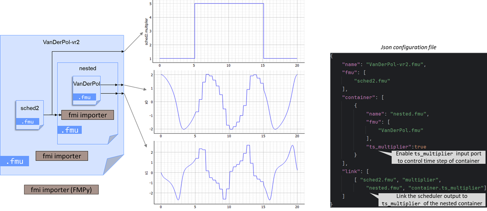
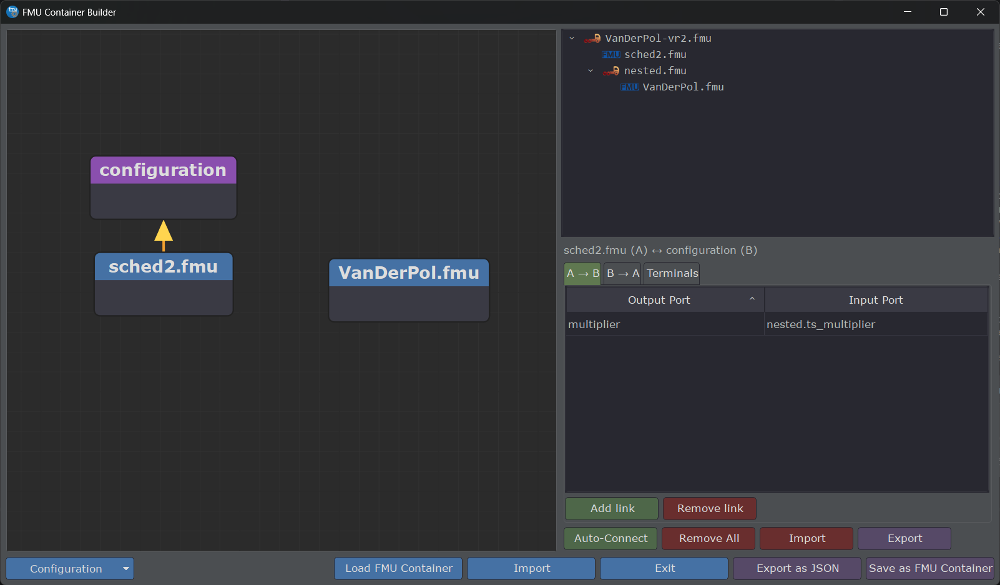

# Container with TS_MULTIPLIER

Sometimes, during the simulation, speed is more important than accuracy.
In such case, having a bigger step size could drastically improve performance.

In this very simple test case, we consider two functional units represented as FMUs.
1. The first FMU, **VanDerPol**, generates two output signals and operates with a variable time step.
2. The second FMU, **sched2**, produces an integer output defined as follows:

    - value 1 for 0 ≤ _t_ < 5,
    - value 5 for 5 ≤ _t_ < 15,
    - value 1 for 15 ≤ _t_ < 20.

The objective of this study is to use the output of **sched2** to dynamically scale the sampling step of 
the **VanDerPol** FMU, whose default value is 0.1.

The same assembly can be built visually with the [FMU Container Builder GUI](gui-usage.md), using
the [`configuration` node](gui-usage.md#the-configuration-node-ts_multiplier) to wire **sched2**'s
output to **VanDerPol**'s `ts_multiplier` input:

!!! note "The `configuration` node"
    The `configuration` node automatically appears on the canvas as soon as a sub-container —
    here, **nested** (containing **VanDerPol**) — has its `ts_multiplier` parameter checked.
    Checking `ts_multiplier` on the root container would have no effect.

For illustration purposes, you can find the JSON file used to construct this co-simulation setup, along with the 
corresponding output figure.
