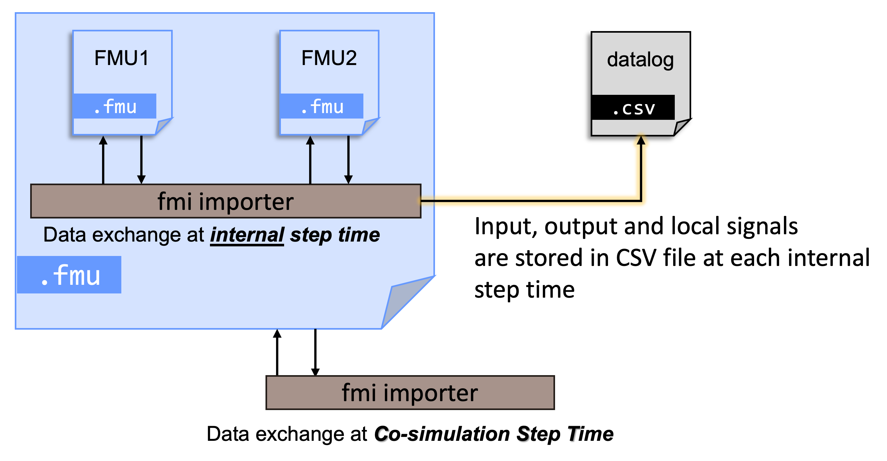

# Container with datalog

To facilitate debugging of FMUs assemblies, the datalog feature is extremely helpful.

You can enable datalog in two ways:

- CLI: add the `-datalog` option to the `fmucontainer` command.
- GUI: in **FMU Container Builder**, open **Configuration** and check **Enable Datalog** before saving.

When enabled, a CSV file is automatically generated.
The file name is derived from the FMU container’s name and contains the values of all signals exchanged during the 
simulation, recorded at each container time step.

## CSV format

- The first line holds the names of the columns: `time`, then one column per signal.
- Each following line is one container time step. Real values are written with every significant digit (17 for a
  `Float64`, 9 for a `Float32`) and always with a decimal dot, whatever the locale of the simulation tool: the time
  and the values read back from the file are exactly those of the simulation.
- A string, or a column name, that contains a comma, a double quote or a line break is enclosed in double quotes,
  its double quotes being doubled (RFC 4180): `"a[1,2]"`, `"say ""hi"""`. Spreadsheets and the Python `csv`
  module read it as one field.
- Binaries are written in hexadecimal, booleans and clocks as `0` or `1`.
