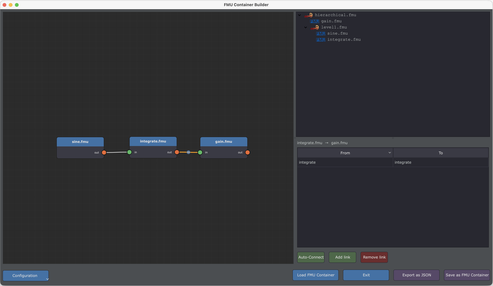

# FMU Container Builder — GUI

The **FMU Container Builder** provides a visual, node-graph interface to assemble multiple FMUs into
a single FMU Container — without writing JSON or CSV files manually.

## Launching the Interface

```bash
fmucontainer-gui
```

Or from the [FMU Toolbox Launcher](../launcher.md), click **FMU Container Build**.



## Interface Overview

The interface is split into three main areas:

| Area | Description |
|---|---|
| **Node Graph** (left) | Visual canvas where FMU nodes and wires are displayed |
| **Tree View** (top-right) | Hierarchical structure of containers and FMUs |
| **Detail Panel** (bottom-right) | Properties of the selected node, wire, or container |
| **Button Bar** (bottom) | Configuration, load/save, and export actions |

## Node Graph

The node graph is the central workspace where you visually compose your FMU container.

### Adding FMU Nodes

There are three ways to add FMUs to the canvas:

- **Drag & Drop**: drag `.fmu` files from your file manager directly onto the canvas.
- **Right-click → Add FMU…**: opens a file dialog to select one or more `.fmu` files.
- **Tree View → Right-click → Add FMU…**: adds FMUs under a specific container in the hierarchy.

Each FMU node displays:

- Its filename as a title
- An **input port** (green, left side) if the FMU has input or parameter variables
- An **output port** (orange, right side) if the FMU has output variables

### Connecting FMUs with Wires

To create a connection between two FMUs:

1. Click and drag from an **output port** (orange) of one node
2. Release on the **input port** (green) of another node
3. A wire is created

!!! info "Port direction"
    You can also drag from an input to an output — the direction is automatically corrected.

### Navigating the Canvas

| Action | How |
|---|---|
| **Pan** | Middle-click drag, or ++alt+left-button++ drag |
| **Zoom** | Mouse wheel |
| **Fit all** | Right-click → **Fit View** |
| **Select** | Left-click on a node or wire |
| **Multi-select** | Rubber-band selection (left-click drag on empty space) |
| **Move node** | Left-click drag on a node |
| **Delete** | Select items, then press ++delete++ or ++backspace++ |

### Context Menu (Right-click on Canvas)

| Action | Description |
|---|---|
| **Add FMU…** | Open file dialog to add FMU nodes |
| **Delete Selection** | Remove selected nodes and wires |
| **Fit View** | Zoom to fit all nodes in the viewport |

## Tree View

The tree view shows the hierarchical structure of your container assembly.

### Root Container

The top-level item represents the output container FMU (default name: `container.fmu`).
All FMU nodes and sub-containers are children of this root.

### Sub-Containers

You can create nested containers to organize complex assemblies:

- **Right-click → Add Container**: creates a new sub-container under the selected item.
- **Rename**: right-click on a container → **Rename**.
- **Drag & Drop**: reorganize nodes and sub-containers by dragging them within the tree.

### Context Menu (Right-click on Tree View)

| Action | Description |
|---|---|
| **Add FMU…** | Add FMU nodes under the selected container |
| **Add Container** | Create a new sub-container |
| **Rename** | Rename a container |
| **Delete** | Remove a node or container (and all its contents) |

## Detail Panel

The detail panel shows the properties of the currently selected element.

### Node (FMU) Details

When an FMU node is selected, the detail panel shows:

- **FMU name**, generator tool, and step size
- **Start Values table**: lists all input ports with their start values

Each row in the start values table shows:

| Column | Description |
|---|---|
| **Input Port** | Port name (read-only) |
| **Start Value** | User-defined start value (editable). A gray placeholder shows the FMU's default value. |

!!! tip "Start Values"
    Leave the start value empty to use the FMU's built-in default. Enter a value to override it
    in the container.

### Wire Details

When a wire is selected, the detail panel shows the **port mappings** between the source and
destination FMUs:

| Column | Description |
|---|---|
| **Output Port** | Output port of the source FMU (combo-box) |
| **Input Port** | Input port of the destination FMU (combo-box) |

Use the buttons below the table:

| Button | Description |
|---|---|
| **Add** | Add a new port mapping row |
| **Remove** | Remove the selected mapping row(s) |
| **Auto-connect** | Automatically map ports that share the same name |

!!! tip "Auto-connect"
    The **Auto-connect** button is very useful when FMUs have been designed to work together — it
    matches output and input ports by name.

### Container Details

When a container is selected in the tree view, the detail panel shows its configuration parameters:

| Parameter | Type | Description |
|---|---|---|
| `step_size` | text | Fixed time step (in seconds) for the container's internal solver |
| `mt` | checkbox | Enable multi-threading (each FMU runs in its own thread) |
| `profiling` | checkbox | Enable performance profiling of embedded FMUs |
| `sequential` | checkbox | Force sequential execution order |
| `auto_link` | checkbox | Automatically link ports with matching names and types |
| `auto_input` | checkbox | Automatically expose unconnected input ports |
| `auto_output` | checkbox | Automatically expose unconnected output ports |
| `auto_parameter` | checkbox | Automatically expose parameter ports |
| `auto_local` | checkbox | Automatically expose local variables |
| `ts_multiplier` | checkbox | Add a `TS_MULTIPLIER` input for dynamic step size control |

## Button Bar

### Configuration

Click **Configuration** to open a popup menu with:

- **Generate FMI-2 / FMI-3**: choose the target FMI version for the output container.
- **Verbose Mode**: enable detailed logging and keep intermediate build artifacts.

### Actions

| Button | Description |
|---|---|
| **Load FMU Container** | Load an existing FMU container (splits it and reconstructs the graph) |
| **Export as JSON** | Export the assembly as a JSON description file |
| **Save as FMU Container** | Build and save the container as a `.fmu` file |
| **Exit** | Close the window (prompts if there are unsaved changes) |

## Typical Workflow

### Step 1: Add FMUs

Drag and drop your `.fmu` files onto the canvas, or use the right-click menu.

### Step 2: Connect FMUs

Draw wires between output and input ports. Select a wire to configure the port-level mappings
in the detail panel. Use **Auto-connect** to speed up the process.

### Step 3: Configure the Container

Select the root container in the tree view to set the time step and other options
(multi-threading, profiling, auto-linking, etc.).

### Step 4: Organize Hierarchy (Optional)

Create sub-containers and drag FMUs into them to build nested assemblies.

### Step 5: Set Start Values (Optional)

Select individual FMU nodes and override input port start values as needed.

### Step 6: Save

Click **Save as FMU Container** to build the final `.fmu` file, or **Export as JSON** to save
the assembly description for later use with the `fmucontainer` CLI.

## Loading an Existing Container

Click **Load FMU Container** to open an existing `.fmu` container. The tool will:

1. Split the container to extract the embedded FMUs and the JSON description
2. Reconstruct the node graph with all FMUs, wires, port mappings, and start values
3. Restore container parameters (step size, multi-threading, etc.)

You can then modify the assembly and re-save it.

!!! warning "Unsaved Changes"
    If you have unsaved changes when closing the window or loading a new container, you will be
    prompted to confirm.

