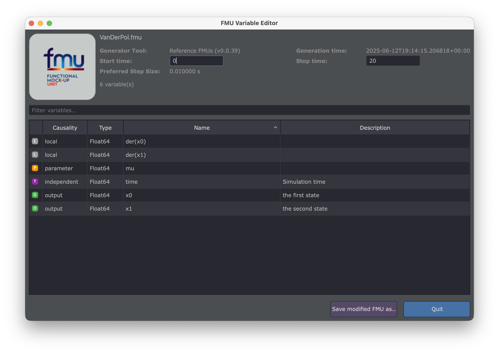

# FMU Variable Editor — GUI

The **FMU Variable Editor** provides a spreadsheet-like interface to inspect and edit FMU variables
(names and descriptions) as well as simulation experiment settings — without using the command line.

## Launching the Interface

```bash
fmueditor
```

Or from the [FMU Toolbox Launcher](../launcher.md), click **FMU Variables Editor**.



## Interface Overview

The interface is organized into the following areas:

| Area | Description |
|---|---|
| **Drop Zone** (top-left) | Drag & drop area to load an FMU |
| **FMU Info** (top-right) | Metadata: name, generator tool, date, step size, experiment settings |
| **Filter Bar** (middle) | Text field to filter variables across all columns |
| **Variable Table** (center) | Sortable, editable table of all FMU variables |
| **Bottom Bar** | Save button, quit button, and status messages |

## Loading an FMU

Drag and drop a `.fmu` file onto the **drop zone** in the top-left corner.

Once loaded, the interface displays:

- **FMU name** (bold title)
- **Generator Tool** and **Generation Date**
- **Start Time** and **Stop Time** (editable)
- **Preferred Step Size** (read-only)
- **Variable count**

## Variable Table

The table lists all variables defined in the FMU's `modelDescription.xml`:

| Column | Description |
|---|---|
| *(icon)* | Color-coded causality icon |
| **Causality** | `input`, `output`, `parameter`, `local`, `independent`, etc. |
| **Type** | FMI data type (`Real`, `Integer`, `Boolean`, `String`, …) |
| **Name** | Variable name — **editable** |
| **Description** | Variable description — **editable** |

### Causality Icons

Each variable is tagged with a color-coded icon:

| Icon | Causality |
|---|---|
| **I** (blue) | Input |
| **O** (green) | Output |
| **P** (orange) | Parameter |
| **L** (gray) | Local |
| **T** (purple) | Independent |
| **C** (brown) | Calculated Parameter |
| **S** (teal) | Structural Parameter |

### Editing Variables

- **Rename a variable**: double-click on the **Name** cell and type the new name.
- **Edit a description**: double-click on the **Description** cell.
- Modified values are highlighted in **orange** to indicate unsaved changes.

### Sorting and Filtering

- **Sort**: click any column header to sort ascending/descending.
- **Filter**: type in the filter bar to instantly filter variables across all columns
  (name, causality, type, description).

## Editing Experiment Settings

The **Start Time** and **Stop Time** fields in the top-right area are editable:

- Modify the values directly in the text fields.
- Changes will be written into the `DefaultExperiment` element of the `modelDescription.xml`
  when saving.

!!! note
    The **Preferred Step Size** is displayed for information only and cannot be edited here.

## Saving the Modified FMU

1. Click **Save modified FMU as…**
2. Choose a filename and location
3. The new FMU is created with all your modifications applied

!!! warning "Original FMU is preserved"
    The original FMU file is **never modified**. You always save to a new file.

Only modified variables and experiment settings are written — unchanged variables pass through
as-is.

## Unsaved Changes Detection

If you close the editor or load a new FMU while there are unsaved modifications, a confirmation
dialog will appear asking whether you really want to discard your changes.

## Typical Workflow

### Rename Variables in Bulk

1. Load the FMU
2. Use the filter bar to find variables (e.g., type `Motor`)
3. Double-click each **Name** cell to rename
4. Save the modified FMU

### Add or Edit Descriptions

1. Load the FMU
2. Sort by **Causality** to group inputs, outputs, etc.
3. Double-click **Description** cells to add or update documentation
4. Save

### Adjust Simulation Timing

1. Load the FMU
2. Edit **Start Time** and/or **Stop Time** in the top-right panel
3. Save

## Keyboard Shortcuts

| Shortcut | Action |
|---|---|
| Double-click cell | Edit variable name or description |
| Click column header | Sort by column |
| Type in filter bar | Filter variables |


