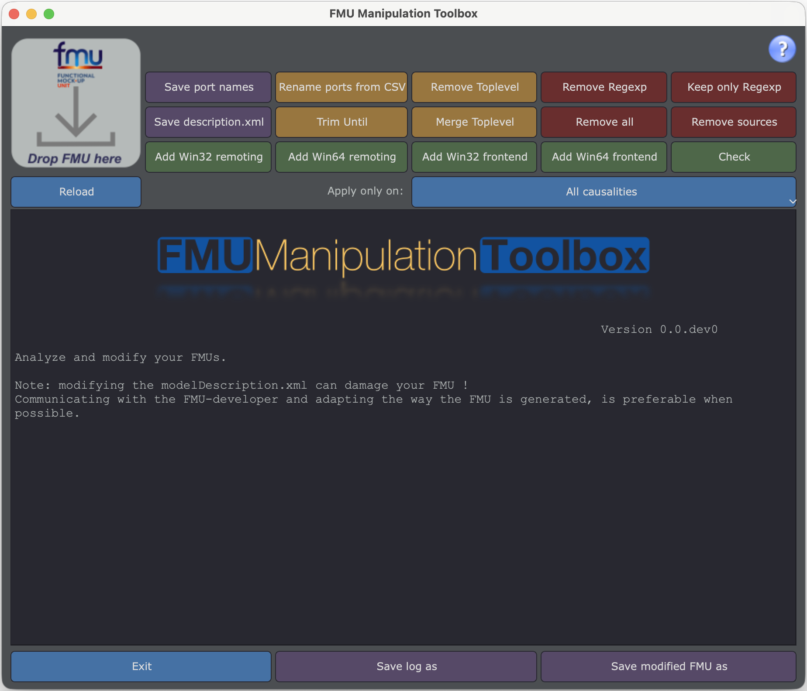

# Graphical User Interface (GUI) Usage Guide

The graphical interface of **FMU Manipulation Toolbox** offers an intuitive and visual way to manipulate your FMUs without using the command line.

## Launching the Interface

```bash
fmutool-gui
```



## Interface Overview

The graphical interface is organized into several sections:

### 1. Loading Area (Top)
- **Load FMU**: Button to load an FMU from your disk
- Display of loaded FMU name

### 2. Visualization Area (Center)
- List of all FMU ports with their attributes:
  - Name
  - Type (Input, Output, Parameter, Local)
  - Data Type (Real, Integer, Boolean, String)
  - Causality
  - Variability

### 3. Action Area (Right and Bottom)
- Color-coded buttons for different operations
- Filters to limit scope of operations

### 4. Save Area (Bottom)
- **Save**: Button to save modified FMU
- Operation status display

## Button Color Code

The interface uses an intuitive color code:

| Color | Action Type | Examples |
|-------|-------------|----------|
| 🔴 **Red** | Remove information | Remove ports, Remove sources |
| 🟠 **Orange** | Modify modelDescription.xml | Rename, Strip toplevel |
| 🟢 **Green** | Add components or check | Add remoting, Check FMU |
| 🟣 **Purple** | Extract and save | Extract descriptor, Save CSV |
| 🔵 **Blue** | Filter scope or exit | Filter by type, Exit |

## Typical Workflow

### Step 1: Load an FMU

1. Click **Load FMU**
2. Navigate to your `.fmu` file
3. Select the file and validate

**Result:** The port list displays in the central area.

### Step 2: Explore Ports

The list displays all important information:

```
Name                    | Causality | Variability | Type
------------------------|-----------|-------------|------
Motor.Temperature       | output    | continuous  | Real
Motor.Speed             | input     | continuous  | Real
Controller.Gain         | parameter | fixed       | Real
```

**List Features:**
- **Sort**: Click column headers to sort
- **Search**: Use Ctrl+F to search in list
- **Selection**: Click a row to select it

### Step 3: Apply Transformations

#### 🟣 Export Port List to CSV

**Use Case:** Prepare a file for renaming ports

1. Click **Export to CSV**
2. Choose location and filename
3. Click **Save**

**Result:** A CSV file with all ports is created.

#### 🟠 Remove Top-Level Hierarchy

**Use Case:** Simplify name hierarchy

**Before:**
```
System.Motor.Temperature
System.Motor.Speed
System.Controller.Gain
```

**Action:**
1. Click **Strip Toplevel**
2. Confirm action

**After:**
```
Motor.Temperature
Motor.Speed
Controller.Gain
```

#### 🟠 Rename Ports from CSV

**Prerequisite:** Have a CSV file with `name;newName` columns

1. Click **Rename from CSV**
2. Select your CSV file
3. Validate

**The FMU is updated with new names!**

#### 🔴 Remove Ports

**Option 1: Remove by Regular Expression**

1. Click **Remove by RegExp**
2. Enter regular expression (e.g., `^Internal\..*`)
3. Validate

**Option 2: Remove All Ports of a Type**

1. Use filters (blue buttons) to select type
   - **Only Parameters**
   - **Only Inputs**
   - **Only Outputs**
2. Click **Remove All**
3. Confirm

#### 🟢 Add Binary Interface (Windows Only)

**Use Case:** Add 64-bit interface to 32-bit FMU

1. Click **Add Remoting Win64**
2. Wait for processing to complete
3. The FMU can now be used in both 32 and 64 bits

**Also Available:**
- **Add Remoting Win32**: Add 32-bit interface
- **Add Frontend Win32/Win64**: Run FMU in separate process

#### 🟢 Check FMU

**Use Case:** Validate FMU compliance with FMI standard

1. Click **Check FMU**
2. View results in status area

**Possible Results:**
- ✅ **Valid**: FMU is compliant
- ⚠️ **Warnings**: FMU has minor issues
- ❌ **Errors**: FMU has major issues

### Step 4: Filter Operations

Blue buttons allow limiting action scope:

#### 🔵 Filter by Port Type

**Only Parameters**: Operations apply only to parameters

**Usage Example:**
1. Click **Only Parameters**
2. Click **Export to CSV**
3. Only parameters are exported

**Other Filters:**
- **Only Inputs**
- **Only Outputs**

#### 🔵 Reset Filters

Click **Clear Filters** to return to full view.

### Step 5: Save Modified FMU

⚠️ **IMPORTANT**: The original FMU is **never modified**.

1. Click **Save**
2. Choose name and location for new FMU
3. Validate

**The new FMU contains all your modifications!**

## Usage Examples

### Example 1: Simplify FMU Structure

**Objective:** Remove `VehicleModel.` prefix from all ports

**Steps:**
1. Load FMU → `VehicleModel.fmu`
2. Strip Toplevel
3. Save → `VehicleModel_simplified.fmu`

**Result:**
- Before: `VehicleModel.Engine.Temperature`
- After: `Engine.Temperature`

### Example 2: Export Only Parameters

**Objective:** Create CSV file with only parameters

**Steps:**
1. Load FMU → `module.fmu`
2. Only Parameters (filter)
3. Export to CSV → `parameters.csv`

### Example 3: Clean Internal Variables

**Objective:** Remove all variables starting with `_internal`

**Steps:**
1. Load FMU → `module.fmu`
2. Remove by RegExp
3. Enter: `^_internal.*`
4. Validate
5. Save → `module_clean.fmu`

## Keyboard Shortcuts

| Shortcut | Action |
|----------|--------|
| Ctrl+O | Open an FMU |
| Ctrl+S | Save FMU |
| Ctrl+F | Search in list |
| Ctrl+Q | Quit application |
| F5 | Refresh view |

## Best Practices

### ✅ Do

- **Always save with a new name** to keep original intact
- **Check FMU** after important modifications (Check FMU button)
- **Test modified FMU** in your simulation environment before production use
- **Document your modifications** by noting applied transformations

### ❌ Avoid

- **Don't chain too many operations** without intermediate saves
- **Don't modify without backup** of original
- **Don't delete essential ports** without checking dependencies
- **Don't forget to save** before closing the application

## GUI Limitations

### Performance

For FMUs with **>5000 variables**, the interface may be slow.

**Solution:** Use command line or Python API for better performance.

### Complex Operations

Some advanced operations are only available via command line:
- Batch processing
- Automation scripts

!!! tip "Other GUI Tools"
    Looking for more graphical tools?
    
    - **[FMU Variable Editor](../fmueditor.md)** (`fmueditor`): spreadsheet-like editor for variable names and descriptions.
    - **[FMU Container Builder](../fmucontainer/gui-usage.md)** (`fmucontainer-gui`): visual node-graph editor to assemble FMU containers.
    - **[FMU Toolbox Launcher](../launcher.md)** (`fmutoolbox`): unified launcher for all GUI tools.

## Troubleshooting

### Interface Won't Launch

**Problem:** `ModuleNotFoundError: No module named 'tkinter'`

**Solution:**
```bash
# Linux
sudo apt-get install python3-tk

# macOS
brew install python-tk
```

### Interface is Frozen

**Solution:**
1. Close application
2. Relaunch with smaller FMU
3. Or use command line

## Going Further

For more advanced operations:

- 📖 [CLI Guide](cli-usage.md) - Command line usage
- 🐍 [Python API](python-api.md) - Automation with scripts
- 💡 [Examples](../../examples/examples.md) - Advanced use cases

## Support

For any questions or issues:
- 📚 [Troubleshooting](../../help/troubleshooting.md)
- 🐛 [GitHub Issues](https://github.com/grouperenault/fmu_manipulation_toolbox/issues)
