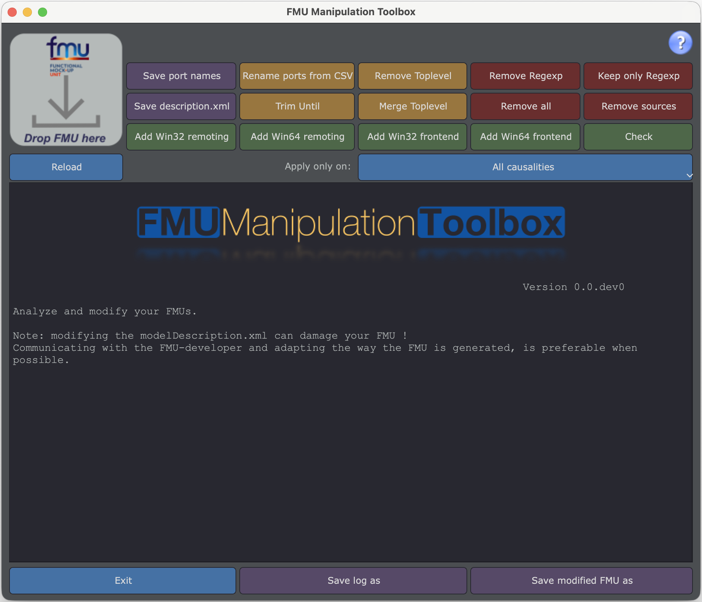

# Graphical User Interface (GUI) Usage Guide

The graphical interface of **FMU Manipulation Toolbox** offers an intuitive and visual way to manipulate your FMUs without using the command line.

!!! note "Requires the `gui` extra"
    The GUI is built with [PySide6](https://pypi.org/project/PySide6/) (Qt for Python), which is
    an optional dependency. Install it with `pip install "fmu-manipulation-toolbox[gui]"` — see the
    [Installation Guide](../../installation.md).

## Launching the Interface

```bash
fmutool-gui
```



## Interface Overview

The window is organized as a single grid:

### 1. Drop Zone / Loading Area (top-left)
- **Drop zone**: click it, or drag & drop a `.fmu` file onto it, to load an FMU.
- The loaded FMU name is shown next to it, together with the online **help** icon (opens the
  documentation website).

### 2. Operation Buttons (grid, upper area)
- One color-coded button per available operation (see [Button Color Code](#button-color-code)).
- Clicking a button immediately applies the corresponding operation to the loaded FMU (some
  buttons prompt for a value or a file first).

### 3. Reload / Filter Row
- **Reload** button: discards all changes applied so far and reloads the FMU from disk.
- **Apply only on:** a single dropdown button listing all causalities
  (`parameter`, `calculatedParameter`, `input`, `output`, `local`, `independent`). Uncheck the
  causalities you want to *exclude*; every operation triggered afterwards only applies to the
  causalities that remain checked.

### 4. Log Area (center)
- A scrollable text log reporting every action performed: the FMU summary (printed automatically
  after loading), each applied operation, and any warning or error.
- This is **not** an editable/sortable port table — port names are only shown as part of the
  logged text (e.g. the `-summary` output or CSV export confirmation).

### 5. Bottom Bar
- **Exit**: close the application.
- **Save log as**: export the log area content to a `.txt` file.
- **Save modified FMU as**: repack the current (in-memory) modifications into a new `.fmu` file.

## Button Color Code

The interface uses an intuitive color code (matching the operation's effect):

| Color | Action Type | Examples |
|-------|-------------|----------|
| 🔴 **Red** | Remove information | Remove Regexp, Keep only Regexp, Remove all, Remove sources |
| 🟠 **Orange** | Modify `modelDescription.xml` | Rename ports from CSV, Remove Toplevel, Merge Toplevel, Trim Until |
| 🟢 **Green** | Add components or check | Add Win32/Win64 remoting, Add Win32/Win64 frontend, Check |
| 🟣 **Purple** | Extract and save | Save port names, Save description.xml, Save log as, Save modified FMU as |
| 🔵 **Blue** | Filter scope or exit | Apply only on, Reload, Exit |

## Typical Workflow

### Step 1: Load an FMU

1. Click the drop zone (or drag & drop a `.fmu` file onto it).

**Result:** The FMU name is displayed, and its summary (`-summary` equivalent) is automatically
logged in the central log area.

### Step 2: Explore the FMU

The log area shows the FMU summary: FMI properties, co-simulation capabilities, default
experiment values, supported platforms, embedded resources, and the number of ports per
causality.

**Tip:** Every subsequent operation appends its own log section below, so you can scroll back
to review everything that has been applied so far.

### Step 3: Apply Transformations

#### 🟣 Save Port Names to CSV

**Use Case:** Prepare a file for renaming ports

1. Click **Save port names**
2. Choose location and filename in the file dialog

**Result:** A CSV file with all ports (or only the causalities selected in the filter) is created.

#### 🟠 Remove Top-Level Hierarchy

**Use Case:** Simplify name hierarchy

**Before:**
```
System.Motor.Temperature
System.Motor.Speed
System.Controller.Gain
```

**Action:** Click **Remove Toplevel**.

**After:**
```
Motor.Temperature
Motor.Speed
Controller.Gain
```

#### 🟠 Rename Ports from CSV

**Prerequisite:** Have a CSV file with `name;newName` columns (e.g. produced by **Save port names**)

1. Click **Rename ports from CSV**
2. Select your CSV file in the file dialog

**The in-memory FMU is updated with new names — remember to use Save modified FMU as afterwards!**

#### 🔴 Remove Ports

**Option 1: Remove by Regular Expression**

1. Click **Remove Regexp**
2. Enter a regular expression in the prompt (e.g., `^Internal\..*`)
3. Validate

**Option 2: Restrict to a Causality First**

1. Open **Apply only on:** and uncheck every causality except the one(s) you want to target
   (e.g. keep only `parameter` checked)
2. Click **Remove all** (removes every remaining port matching the filter)

#### 🟢 Add Binary Interface (Windows FMUs)

**Use Case:** Add a 64-bit interface to a 32-bit-only Windows FMU

1. Click **Add Win64 remoting**
2. Wait for processing to complete

**Also Available:**
- **Add Win32 remoting**: add a 32-bit interface to a 64-bit-only FMU
- **Add Win32 frontend** / **Add Win64 frontend**: wrap the existing DLL behind a remoting
  front-end for process isolation, without changing bitness

See the [Remoting Guide](remoting.md) for the full picture (this operation only applies to
FMI 2.0 co-simulation FMUs).

#### 🟢 Check FMU

**Use Case:** Validate FMU compliance with the FMI standard

1. Click **Check**
2. Read the result in the log area (compliant / not compliant, with XSD validation details)

### Step 4: Restrict the Scope of an Operation

Use **Apply only on:** to limit *any* subsequent operation to a subset of causalities:

1. Click **Apply only on:**
2. Uncheck the causalities you want to exclude (at least one must remain checked)
3. Trigger any operation button — it will only affect ports whose causality is still checked

The button label reflects the current selection (e.g. `parameter, input`), or **All causalities**
when nothing is excluded.

### Step 5: Save Modified FMU

⚠️ **IMPORTANT**: The original FMU is **never modified**.

1. Click **Save modified FMU as**
2. Choose name and location for the new FMU

**The new FMU contains all your modifications!**

## Usage Examples

### Example 1: Simplify FMU Structure

**Objective:** Remove `VehicleModel.` prefix from all ports

**Steps:**
1. Load FMU → `VehicleModel.fmu`
2. Click **Remove Toplevel**
3. Click **Save modified FMU as** → `VehicleModel_simplified.fmu`

**Result:**
- Before: `VehicleModel.Engine.Temperature`
- After: `Engine.Temperature`

### Example 2: Export Only Parameters

**Objective:** Create a CSV file with only parameters

**Steps:**
1. Load FMU → `module.fmu`
2. **Apply only on:** → uncheck everything except `parameter`
3. Click **Save port names** → `parameters.csv`

### Example 3: Clean Internal Variables

**Objective:** Remove all variables starting with `_internal`

**Steps:**
1. Load FMU → `module.fmu`
2. Click **Remove Regexp**
3. Enter: `^_internal.*`
4. Validate
5. Click **Save modified FMU as** → `module_clean.fmu`

## Best Practices

### ✅ Do

- **Always save with a new name** to keep original intact
- **Check FMU** after important modifications (Check button)
- **Test modified FMU** in your simulation environment before production use
- **Save the log** (Save log as) to keep a trace of the applied transformations

### ❌ Avoid

- **Don't chain too many operations** without saving intermediate results
- **Don't modify without backup** of the original
- **Don't forget to click Save modified FMU as** before closing the application — in-memory
  operations are lost otherwise

## GUI Limitations

### Performance

For FMUs with **many thousands of variables**, logging every port during an operation may make
the log area slow to scroll.

**Solution:** Use command line or Python API for better performance on very large FMUs.

### Complex Operations

Some advanced or repetitive operations are only practical via command line or Python API:

- Batch processing of many FMUs
- Automation scripts / CI pipelines
- Writing and registering [custom checkers](checker.md)

!!! tip "Other GUI Tools"
    Looking for more graphical tools?
    
    - **[FMU Variable Editor](fmueditor.md)** (`fmueditor`): spreadsheet-like editor for variable names and descriptions.
    - **[FMU Container Builder](../fmucontainer/gui-usage.md)** (`fmucontainer-gui`): visual node-graph editor to assemble FMU containers.
    - **[FMU Toolbox Launcher](../launcher.md)** (`fmutoolbox`): unified launcher for all GUI tools.

## Troubleshooting

### Interface Won't Launch

**Problem:** `ModuleNotFoundError: No module named 'PySide6'`

**Solution:** Install the GUI extra:
```bash
pip install "fmu-manipulation-toolbox[gui]"
```

**Problem:** On Linux, Qt fails to start with an error about the `xcb` platform plugin.

**Solution:** Install the system Qt/X11 dependencies, e.g. on Ubuntu/Debian:
```bash
sudo apt-get install libxcb-cursor0
```

### Interface is Frozen

**Solution:**
1. Wait — very large FMUs can take a while to load or to log a full summary.
2. If it is truly stuck, close the application and relaunch with a smaller FMU, or use the
   command line / Python API instead.

## Going Further

For more advanced operations:

- 📖 [CLI Guide](cli-usage.md) - Command line usage
- 🐍 [Python API](python-api.md) - Automation with scripts
- 💡 [Examples](../../examples/examples.md) - Advanced use cases

## Support

For any questions or issues:
- 📚 [Troubleshooting](../../help/troubleshooting.md)
- 🐛 [GitHub Issues](https://github.com/grouperenault/fmu_manipulation_toolbox/issues)
