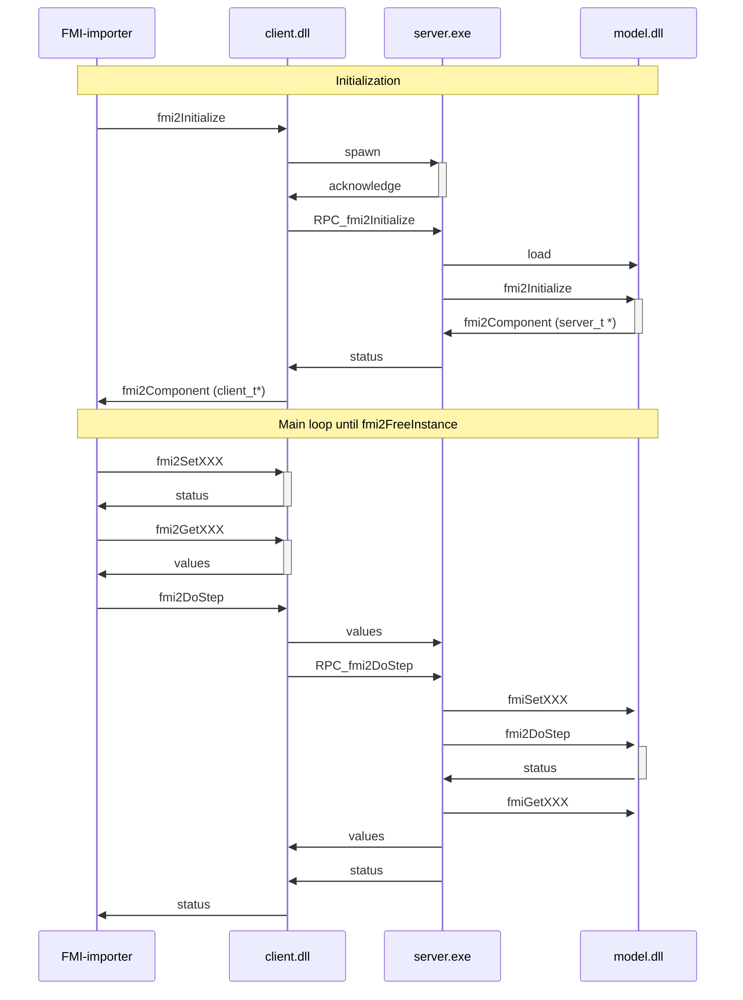

# Remoting

## What is it ?

The remoting feature lets you implement an additional interface to an existing FMU.
There are 3 use cases:
1. Add a different bitness interface. For example, add a Windows 64bits interface to a existing 32bits only FMU.
2. Encapsulate the DLL of an existing FMU inside a dedicated process. This process will communicate with the simulation 
master.
3. Add a different OS interface. This feature is under study.

## Rationale

Some OS can support 32-bits and 64-bits. Remoting feature adds a new interface to an existing FMU and let
the user mix bitness between fmi-importer and the DLL contained into the FMU.


## Limitation

Currently, only Co-simulation mode for FMI 2.0 is supported.


## Available configurations

| FMU \ master   | Windows 32bits        | Windows 64bits        | Linux 32bit                           | Linux 64bits                          |   
|----------------|-----------------------|-----------------------|---------------------------------------|---------------------------------------|
| Windows 32bits | `-add-frontend-win32` | `-add-remoting-win64` | -                                     | -                                     |
| Windows 64bits | `-add-remoting-win32` | `-add-frontend-win64` | -                                     | -                                     |
| Linux 32bits   | -                     | -                     | See `OperationAddRemotingWinAbstract` | See `OperationAddRemotingWinAbstract` |
| Linux 64bits   | -                     | -                     | See `OperationAddRemotingWinAbstract` | See `OperationAddRemotingWinAbstract` |


## Implementation

Current implementation relies on Shared Memory and Semaphore. It is available on Windows and Linux only.
Primary OS is Windows.

This version supports:
   - ONLY FMI 2.0, ONLY for co-simulation mode
   - Strings are NOT supported

### Sequence Diagram



### Performances

To improve performance, this implementation minimize the number of Inter Process Communication calls. So that,
values of signal of the DLL are cached on client side in local buffers.


### How does it work?

Considering win64 FMU, only the `binaries/win64` folder is populated. It contains `model.dll`.

#### Add remoting win32: simulate 64bits FMU 32 bits OS
  1. Copy `client_sm.dll` (32 bits) as `model.dll` in `binaries/win32`
  2. Copy `server_sm.exe` (64 bits) in `binaries/win64`
  
When Simulation Environment will use the FMU on 32 bits OS:
  1. it will load  `win32/model.dll` (which is a copy of `client_sm.dll`)
  2. which will communicate with `win64/server_exe`.
  3. which will load `win64/model.dll` 

#### Add remoting win64: simulate 32 bits FMU 64 bits OS
  1. Copy `client_sm.dll` (64 bits) as `model.dll` in `binaries/win64`
  2. Copy `server_sm.exe` (32 bits) in `binaries/win32`
  
  When Simulation Environment will use the FMU on 64bits kernel:
  1. it will load  `win64/model.dll` (which is a copy of `client_sm.dll`)
  2. which will communicate with `win32/server_exe`.
  3. which will load `win32/model.dll` 


## Usage with `fmutool`

This feature is available easily with `fmutool` command line or with its graphical user interface:

```bash
fmutool -input model64.fmu -add-remoting-win32 -output model64+32.fmu
```

The available options are `-add-remoting-win32`, `-add-remoting-win64`, `-add-frontend-win32` and
`-add-frontend-win64` (see the [configurations table](#available-configurations) above and the
[CLI Guide](cli-usage.md#add-binary-interface-windows)).


## LICENSE

Using the remoting code will alter your FMU by introducing additional interface.
This code is released under the 2-Clause BSD license — see [LICENSE.txt](https://github.com/grouperenault/fmu_manipulation_toolbox/blob/main/LICENSE.txt)
for the full text.
