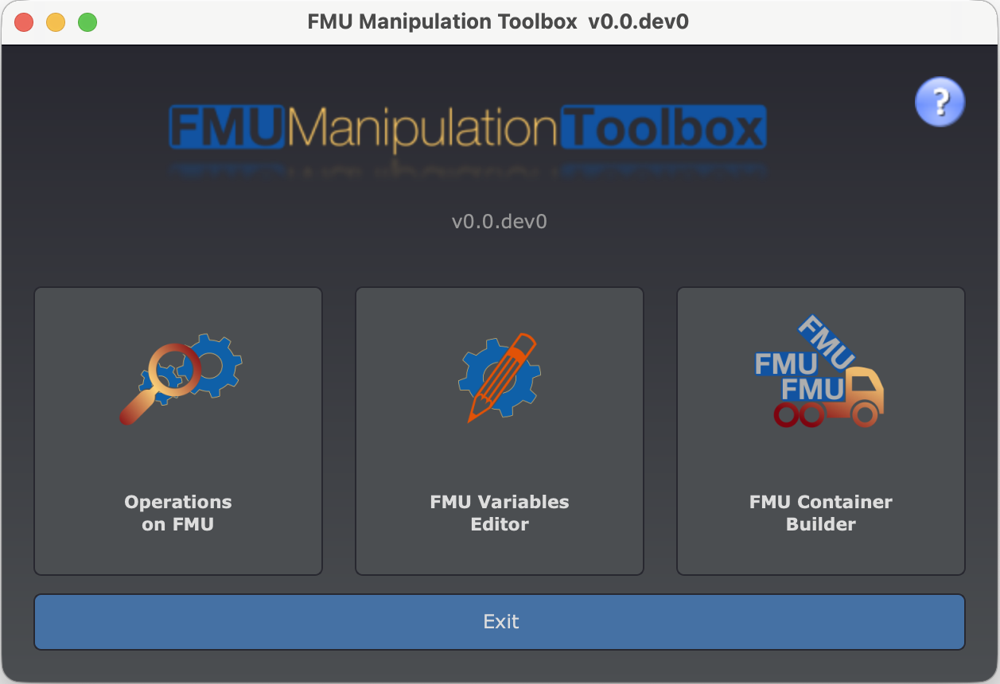

# FMU Toolbox Launcher

The **FMU Toolbox Launcher** is the unified entry point for all graphical tools provided by
FMU Manipulation Toolbox. It presents a home screen with quick-access buttons to each GUI application.

## Launching

```bash
fmutoolbox
```



## Available Tools

The launcher window offers three buttons:

| Button | Tool | Command | Description |
|---|---|---|---|
| **Operations on FMU** | [FMU Tool GUI](fmutool/gui-usage.md) | `fmutool-gui` | Analyze and modify FMUs: rename ports, remove variables, add remoting, check compliance, etc. |
| **FMU Variables Editor** | [FMU Variable Editor](fmutool/fmueditor.md) | `fmueditor` | Spreadsheet-like editor to rename variables, edit descriptions, and adjust experiment settings. |
| **FMU Container Build** | [FMU Container Builder](fmucontainer/gui-usage.md) | `fmucontainer-gui` | Visual node-graph editor to assemble multiple FMUs into a container. |

Each button opens the corresponding tool in a **separate window**. You can have multiple tools
open at the same time.

!!! tip "Direct launch"
    You can also launch each tool individually from the command line without going through the
    launcher. See the table above for the corresponding commands.

